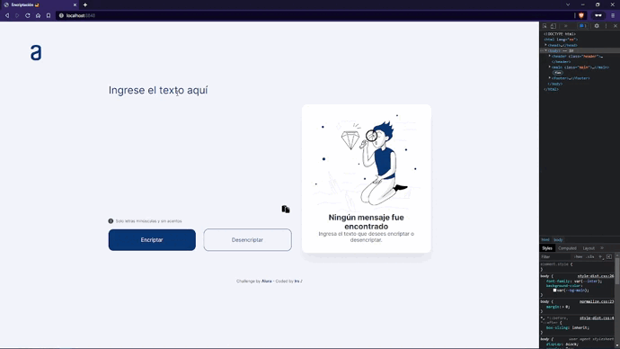
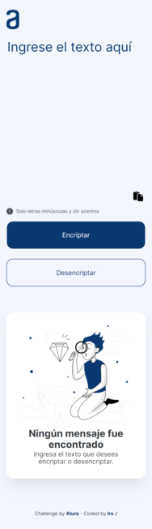
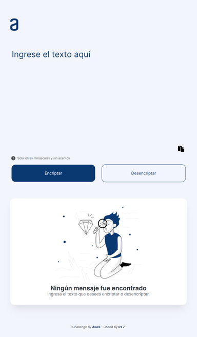
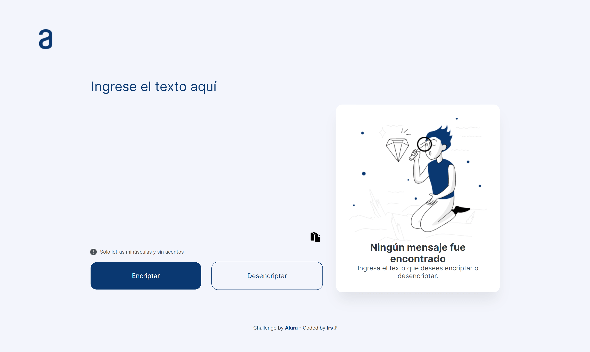

# Alura Latam - Encriptador 🔐

Hola 👋

Esta es mi solución para el Challenge ORACLE + Alura LATAM [Encriptador de texto con JavaScript](https://www.aluracursos.com/challenges/oracle-one/semana01y02-construye-un-encriptador-texto-con-javascript). 



## Table of contents

  - [Screenshot](#screenshot)
  - [Link](#link)
  - [Desarrollado con](#desarrollado-con)
  - [¿Qué he aprendido?](#qué-he-aprendido)
  - [Recursos útiles](#recursos)
  - [Autor](#autor)

## Screenshot

- Mobile



- Tablet



- Desktop



## Link

- [Live](https://irs-mp.github.io/encryption/) 👀

## Desarrollado con

- Mobile-first
- HTML semántico
- CSS custom properties (Variables CSS)
- CSS Flex
- CSS Grid

## Qué he aprendido

- He aprendido mucho con este desafío. Todo javascript es nuevo para mí.
- La sección de encriptación es lo que más me ha costado:

  - Creamos un array vacio
    ```js
    let newStr = []
    ```
  -  Recorre la longitud del texto ingresado
    ```js
    for (let i = 0; i < inputValue.length; i++)
    ```
  - Creamos una variable donde almacenaremos los valores reemplazados (de las vocales)
    ```js
        let newValue = inputValue[i].toString()
          .replace(/e/g, "enter")
          .replace(/i/g, "imes")
          .replace(/a/g, 'ai')
          .replace(/o/g, 'ober')
          .replace(/u/g, 'ufat')
    ```

  - Con el método PUSH añadimos los valores creados en la varible anterior; a la variable del array vacio creado al inicio
    ```js
        newStr.push([newValue])
    ```

  - La cadena codificada final es el resultado y lo insertamos en textarea de salida
  - Con el método JOIN unimos los elementos del array; y para eliminar las comas entre elementos, agregamos ('')
    ```js
      outputTxt.textContent = newStr.join('')
    ```


## Recursos

- [HTML desde cero](https://www.youtube.com/watch?v=vz4z0RLcAyk&t=16726s)

- [CSS desde cero](https://www.youtube.com/watch?v=N8V5JhasaSE&t=2s)

- [Expresiones regulares](https://www.youtube.com/watch?v=wfogZfIS03U)

- [Copiar & Pegar (Leer datos del portapapeles)](https://web.dev/i18n/es/async-clipboard/)

- [Git & GitHub](https://www.youtube.com/watch?v=4OXXLtbM8IE&list=PLDbrnXa6SAzUyitkL4zcnWO07HxG0BvmS)

## Autor

- Frontend Mentor - [@Irs-mp](https://www.frontendmentor.io/profile/Irs-mp)
- Twitter - [@Irs_mp](https://twitter.com/Irs_mp)
